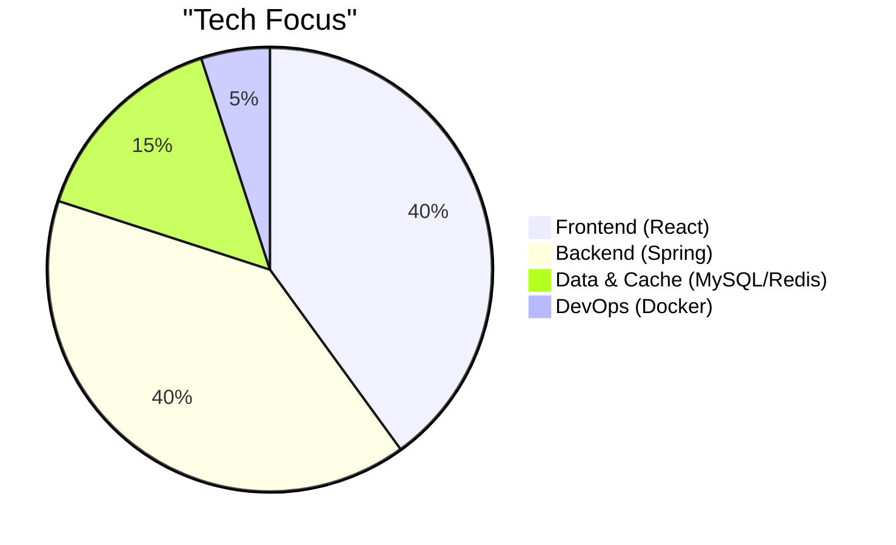
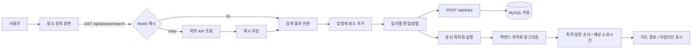
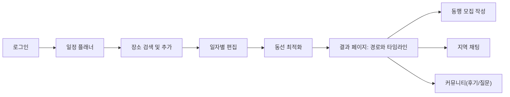

# TripMate · 개인 프로젝트
여행 일정을 만들고, **동선을 최적화**하며, 동행/커뮤니티/지역 채팅까지 아우르는 올인원 웹 앱


-DC382D?logo=redis&labelColor=1a1a1a)


> **핵심 포인트**
> - 프론트/백 **완전 분리** (React SPA ↔ Spring REST API)  
> - **최적 동선 탐색 알고리즘** 직접 구현 (하루 일정 방문 순서/예상 소요시간 산출)  
> - **Redis 캐싱으로 Google Place API 호출 최소화** (중복·근접 검색 응답 가속)  
> - 개인 프로젝트

---

## 📌 주요 기능
- ✈️ **여행 일정 플래너**: 도시/기간 설정 → 장소 검색/추가 → 일자별 편집/정렬/저장  
- 🧭 **동선 최적화**: 장소 리스트 기반 **최적 방문 순서 & 예상 소요시간** 계산  
- 🤝 **동행 모집**: 일정 기반 모집글 작성, 신청/수락/마감  
- 🗣️ **커뮤니티**: 게시글/댓글/좋아요  
- 📍 **지역 채팅**: 도시(지역) 단위 실시간 대화  
- ⚡ **장소 캐싱**: Google Place 검색 결과를 **Redis**에 캐싱 → 반복/근접 검색 즉시 응답  
> 참고: **Redis는 채팅용이 아니라 ‘장소 검색 결과 캐시’ 용도로만 사용**합니다.

---

## 🧰 기술 스택
- **Frontend**: React, Vite, TypeScript, React Router, Axios  
- **Backend**: Spring Boot, Java, Spring Data JPA  
- **Database & Cache**: MySQL(영속 데이터), **Redis(장소 검색 결과 캐싱)**  
- **DevOps**: Docker / Docker Compose(선택), GitHub



---

## 🏛 아키텍처

```mermaid
flowchart TB
  %% === Place 검색: 캐시 저장 & 재사용 ===
  subgraph Search_Flow[Place search: cache save & reuse]
    UI[Client UI] -->|GET /api/places/search| CTRL[PlaceController]
    CTRL --> SVC[PlaceSearchService]

    SVC --> L1[Memory cache (~45s)]
    L1 -- HIT --> RET1[Return (L1)]
    L1 -- MISS --> L2[(Redis cache)]

    %% Redis HIT: 갖다 쓰기
    L2 -- HIT --> PUTL1[Put -> L1] --> RET2[Return (L2)]

    %% Redis MISS: 분산락 -> 외부 호출 -> 저장 -> 반환
    L2 -- MISS --> LOCK{SETNX lock?}
    LOCK -- yes --> CALL[Call external Places (Google/Kakao/OTM)]
    CALL --> MERGE[Normalize & merge\n(photo priority: Google > Kakao > OTM)]
    MERGE --> SAVE[SETEX to Redis (TTL by source)]
    SAVE --> PUTL1 --> RET3[Return (fresh)]

    %% 동시 MISS: 잠깐 대기 후 재조회
    LOCK -- no --> WAIT[Wait 100~300ms] --> RECHECK[Recheck Redis]
    RECHECK -- HIT --> RET4[Return (L2 after fill)]
    RECHECK -- MISS --> FALLBACK[(optional) fallback call] --> SAVE
  end

  %% === 일정/플래너 로드: 캐시 갖다 쓰기(Hydration) ===
  subgraph Hydration_Flow[Planner / trip page load: hydrate from cache]
    UI2[Planner/Trip page] -->|GET /api/trips/{id}/days| TRIPC[TripController]
    TRIPC --> TRIPSVC[TripService]
    TRIPSVC --> DB[(MySQL)]
    DB --> ITEMS[TripItems\n(placeKey, lat/lng, stayMin, ...)]

    %% items 표시용 상세/사진 보강을 캐시에서 끌어옴
    TRIPSVC --> READ[PlaceSearchService\nhydrate(placeKey)]
    READ --> L1b[Memory cache]
    L1b -- HIT --> MERGE1[Merge into items] --> RESP1[Return items+details]
    L1b -- MISS --> L2b[(Redis cache)]
    L2b -- HIT --> MERGE2[Merge into items] --> RESP2[Return items+details]

    %% 캐시에 없으면 스냅샷/재조회로 채우고 재사용
    L2b -- MISS --> FILL{DB snapshot\nor external refresh}
    FILL -- snapshot --> SNAP[Read stored snapshot] --> PUTL2[SETEX Redis] --> MERGE3[Merge] --> RESP3[Return]
    FILL -- refresh  --> EXT2[Call external] --> PUTL2 --> MERGE3 --> RESP3
  end


```

---

##🔄 기능별 흐름도



---

##🗂 프로젝트 구조



---

🌟 하이라이트

프론트/백 완전 분리: SPA ↔ REST 구조로 배포/스케일 유연성 향상

최적 동선 탐색 알고리즘 직접 구현: 방문 순서 자동 산출 + 예상 소요시간 계산

Redis 캐싱: Google Place 검색 결과 캐시 → 응답 속도 개선 & API 호출 절감

확장성 고려: 동행/커뮤니티/지역 채팅 등 도메인 분리로 점진적 확장 용이

---

🗺 로드맵

 캐시 키 전략 및 TTL 고도화 (좌표+반경/키워드 기준)

 동선 최적화 제약 반영 (영업시간/휴식/고정 포인트)

 커뮤니티/채팅 UX 개선 (알림/멘션/모바일 최적화)

 E2E 테스트 및 성능 계측 대시보드

---


